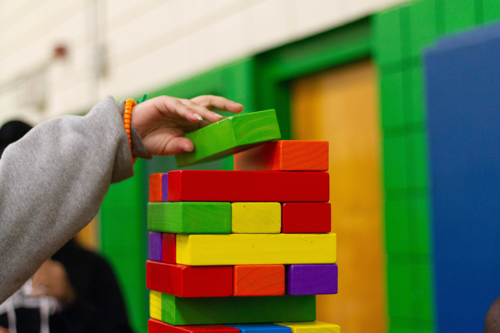

## Yes! Some code!

Here is the `Dump` component!

```jsx
const Dump = props => (
  <div
    style={{
      fontSize: 20,
      border: "1px solid #efefef",
      padding: 10,
    }}
    css={css`
      background: "red";
    `}
  >
    {Object.entries(props).map(([key, val]) => (
      <pre key={key}>
        <strong style={{ color: "white", background: "red" }}>{key} 💩</strong>
        {JSON.stringify(val, "", " ")}
      </pre>
    ))}
  </div>
)

render(<Dump props={"hey"} />)
```
